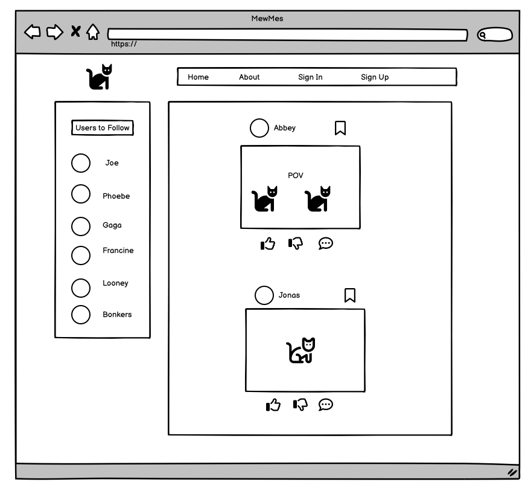
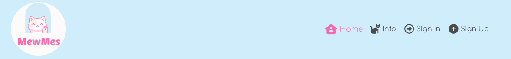
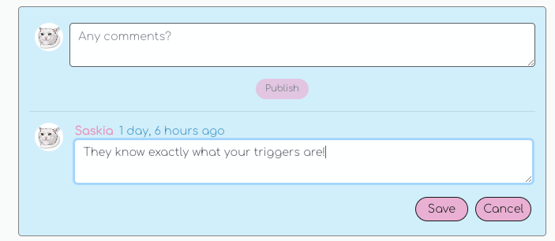
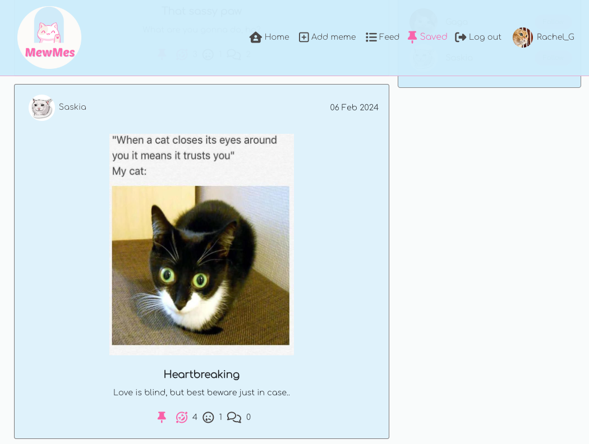
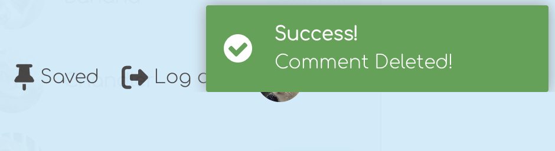
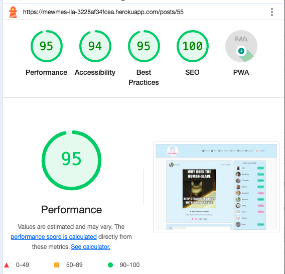
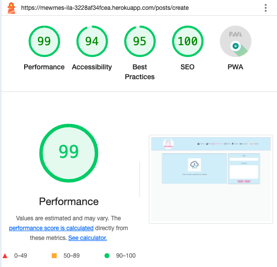

# MewMes

MewMes is a social media platform for cat lovers and meme enthusiasts alike. It was created using React and Django Rest Framework. The purpose of the site is to allow users to share cat memes and interact with memes posted by other users.

#


- [Deployed Front-End page](https://mewmes-ila-3228af34fcea.herokuapp.com/)
- [Deployed Back-End page](https://mewmes-dc42376a8874.herokuapp.com/)
- [Back-End repository](https://github.com/Ila-bura/MewMes_API)

## **Contents**

- [Planning and Project Conception](#planning-and-project-conception)
  - [Project Goals](#project-goals)
  - [Site Goals](#site-goals)
  - [Future Goals](#future-goals)
    - [GitHub Project Board](#github-project-board)
    - [Github Issues](#github-issues)
    - [Wireframes](#wireframes)
    - [List of Wireframe pages](#list-of-wireframe-pages)
  - [User Stories](#user-stories)
    - [Authentication](#authentication)
    - [Navigation](#navigation)
    - [Memes](#memes)
    - [Comments](#comments)
    - [Profiles](#profiles)
  - [Design](#design)
    - [Images](#images)
    - [Colour Scheme](#colour-scheme)
    - [Typography](#typography)
- [Features](#features)
  - [Existing Features](#existing-features)
  - [Logo](#logo)
  - [Custom 404 page](#custom-404-page)
  - [Future Features](#future-features)
- [Technologies](#technologies)
  - [Languages used](#languages-used)
  - [Databases](#databases)
  - [Cloud storage and deployment services](#cloud-storage-and-deployment-services)
  - [Frameworks, tools and libraries](#frameworks-tools-and-libraries)
    - [API Back-End](#api-back-end)
    - [Front-End](#front-end)
  - [Installed packages, libraries and components](#installed-packages-libraries-and-components)
- [Components](#components)
- [Testing](#testing)
  - [Manual Testing](#manual-testing)
  - [Test cases](#test-cases)
  - [Integration Testing](#integration-testing)
  - [Code Validation](#code-validation)
- [Bugs](#bugs)
  - [Bugs encountered during development](#bugs-encountered-during-development)
  - [Bugs and issues encountered during testing](#bugs-and-issues-encountered-during-testing)
  - [Unresolved bugs](#unresolved-bugs)
- [Gitpod set up and deployment](#gitpod-set-up-and-deployment)
  - [Set-up](#set-up-in-gitpod)
  - [Initial Deployment](#initial-deployment)
  - [Deployment issues and bugs](#deployment-issues-and-bugs)
  - [Final Deployment](#final-deployment)
  - [Cloning](#cloning)
  - [Forking](#forking)
- [Credits](#credits)

## **Planning and Project Conception**

### **Project Goals**

### **Site Goals**

- To build an online community around a common interest of cat memes.
- To allow community members to share their favourite memes and interact with each other using the reactions and comment features.
- To allow commnunity members to follow other users whose content is interesting to them.
- To allow users to save meme that are funny to them.

### **Future Goals**

- Add the functionality to like user's comments.
- Allow profile's owners to delete their profile.

[Back to top](#contents)

#

#### **GitHub Project Board**

This project was designed using agile methodologies.
User stories are recorded on the [Project Board](https://github.com/users/Ila-bura/projects/22/views/1).

[Back to top](#contents)

#### **Wireframes**

- The plan for this project is loosely based on the Code Institute Moments walkthrough project.
- Most of the UI is based on the same kind of features and functionality but customised for the specific purposes of MewMes.

#### **List of Wireframe pages**

<details><summary>Home Page on Desktop</summary>
  
  </details>

<details><summary>Home Page on Mobile</summary>
  
  </details>

<details><summary>Sign Up Page</summary>
  
  </details>

<details><summary>Sign In Page</summary>
  
  </details>

<details><summary>User Profile</summary>
  
  </details>

<details><summary>Info Page</summary>
  
  </details>

[Back to top](#contents)

#

### **User Stories**

#### **Authentication**

1. Sign up: as a user I can create an account so that I can access the features for signed up users.

2. Sign in: as a user I can log in so that I can access features only available to logged in users.

3. Sign out: as a user I can log out so that I can exit my account and prevent others from gaining access.

4. Refreshing access tokens: as a user I can maintain my logged in status for 24 hours so that I can easily interact with the app throughout the day.

#### **Navigation:**

5. As a logged in user I can easily view my logged in or out status in the navbar so that I can decide on my next action.

6. Routing: as a user I can view the navbar on every page so that I can easily navigate through the site.

7. Conditional Rendering: as a logged out user I can view sign in and sign up options so that I can easily tell whether I am logged in and can log in easily if not.

8. Avatar: as a logged in user I can view my profile link and avatar image in the navbar so that I can quickly check that I am logged in.

9. Viral profiles list: as a logged in user I can view other user’s profile names and avatars so that I can easily identify and follow other users.

#### **Memes**

10. Create a meme: as a logged in user I can create a new meme so that I can share my best memes with the world.

11. Edit a meme: as a logged in user I can edit my own memes so that I can revise my content, if necessary.

12. Delete a meme: as a logged in user I can delete my own memes so that I can remove content I have posted, if necessary.

13. View most recent memes: as a user I can view all the most recent memes, ordered by most recently created first so that I can immediately be up to date with the newest content.

14. View meme detail: as a logged in user I can view individual meme details so that I can view more details and comments about the meme.

15. React to a meme: as a logged in user I can laugh or unlike a meme so that I can quickly show my reaction to another users content.

16. Save memes: as a logged in user I can save a meme so that I can easily find all the memes I might want to view again at a later stage.

17. View saved memes: as a logged in user I can view saved memes so that I can easily find all the memes that interested me under the Saved section.

18. Search memes: As a user I can search meme and users with keywords so that I can find the memes and user profiles I am most interested in.

#### Comments

19. Create a comment: as a logged in user I can leave a comment under a meme so that I can express my opinion and engage with the content and the community.

20. View comment date: as a user I can see the comment date so that I know how long a go a comment was left.

21. View comments: as a user I can view other comments so that I can see what others have said.

22. Edit comments: as a logged in user I can edit my own comments so that I can revise the content, if necessary.

23. Delete comments: as a logged in user I can delete my own comments so that I can remove them, if necessary.

#### Profiles

24. Profile page: as a user I can view another user’s profile page so that I can see their memes and their bio.

25. User stats: as a user I can see stats on a user profile so that I can see how many memes, followers and following users they have.

26. Follow/Unfollow a user: as a logged in user I can follow other users whose content is relevant or meaningful to me so that I can view content filtered by the users I follow.

27. Edit Profile: as a logged in user I can edit my profile so that I can update my personal details and profile picture.

28. Update username and password: as a logged in user I can update my username and password so that I can make changes as needed.

[Back to top](#contents)

### **Design**

#### **Images**

- The images used for the profile avatar and the one that shows when no results are found, were taken from the Code Institute Moments walkthrough.

<details><summary>Avatar</summary>

</details>

<details><summary>No Results</summary>

</details>

- The images used for the user profiles as well as the memes were all sourced from [Google Images](https://images.google.com/).

- The favicons were created on [Favicon.io](https://favicon.io/).

#### **Colour Scheme**

- The colour palette was generated with Canva, to match the colours of the logo.

<details><summary>Colour Scheme</summary>

</details>

#### **Typography**

- The two main font families used were obtained from the Google Fonts library:

1. Comfortaa
2. Outfit

[Back to top](#contents)

## **Features**

### **Existing Features**

### **Logo**

- The logo was designed with [Canva](https://www.canva.com/) and customised to add the site name.
- The logo was used as the favicon for the webpage as well as the navbar logo home link.

<details><summary>Logo</summary>

</details>

### **NavBar**

NavBar, when the user is not logged in.

<details><summary>Logged Out NavBar</summary>

</details>

NavBar, when the user is logged in.

<details><summary>Logged In NavBar</summary>

</details>

### **Home Page**

The landing page, with the "Most viral profiles" sidebar.

<details><summary>Logged In NavBar</summary>

</details>

### **Meme Page**

- When clicking on a single meme, user is directed to that meme's page, which still features the most viral profiles sidebar.
- Under the meme, the first three icons represent the action a user can take.
- The pin icon is for saving the meme, which can be viewed in the "Saved" section from the NavBar. You need to be logged in to save a meme. When you save a meme, this will be indicated by the "pinned" icon, which turns to a solid shade once it's clicked and if clicked again, this will undo the action of saving the meme.
- The laughing and crying icons are for reacting to the meme. Each icon turns to a solid shade, once a user has clicked on it and will also undo the action if clicked on again. The number next to the icon indicates how many users added their reaction.
- The comment icon displays the number of comments for that meme.
- Underneath the meme, the comment section shows all the comments users left for any given meme.

**Single meme page, when the user is not logged in**

When a logged out user hovers on the pin icon, an overlay message is displayed encouraging logging in to be able to save memes.
When a logged out user hovers on the laughing or crying icons, an overlay message is displayed encouraging logging in to be able to react to memes.
When a logged out user hovers on the comment icon, an overlay message is displayed encouraging logging in to be able to comment on memes. If they click on any of the icons, they are redirected to the Sign In page.
Logged out user do not have the opportunity to leave a comment.

<details><summary>Logged Out Meme Page</summary>

</details>

**Single meme page, when the user is logged in**

<details><summary>Logged In Meme Page</summary>

</details>

- In the comment section logged in users have the opportunity to publish a comment.
  After having published a comment, three vertical dots are displayed on the side of their comment: when clicked, users can edit or delete their own comments.

<details><summary>Logged In Comment Creator</summary>

</details>

<details><summary>Logged In Comment Edit</summary>

</details>

**Single meme page, when the user is logged in and the owner of the meme**

- If a user is the owner of the meme, three vertical dots are displayed on the side of the meme image: when clicked, users can edit or delete their meme.

<details><summary>Logged In Owner Meme Page</summary>

</details>

<details><summary>Logged In Owner Meme Edit</summary>

</details>

### **Info Page**

Here you will find a few engaging lines to describe MewMes to the uninitiated. The icon and link to this page will only appear in the NavBar to logged out users.

<details><summary>Info Page</summary>

</details>

### **Add Meme**

This is where logged in users can upload an image of their meme and complete the Title and Content section, before clicking on the "Create" button to post their meme.

<details><summary>Add Meme</summary>

</details>

### **Feed**

- The Feed consists of memes created by users that you follow.
- If the logged in user is not following anyone, the no results found message is displayed, encouraging them to start following someone.

<details><summary>Feed Page</summary>

</details>

<details><summary>No Followers Feed Page</summary>

</details>

### **Saved**

- The Saved page consists of memes the user has saved by clicking on the pin icon.
- If the logged in user hasn't saved any memes yet, the no results found message is displayed, encouraging them to save a meme.

<details><summary>Saved Page</summary>

</details>

<details><summary>No Saved Page</summary>

</details>

### **Profile Page**

- The profile page shows the profile owner's avatar or image, the stats reporting the number of posted memes, the number of followed and following profiles. There is also a bio section, under which all the memes the owner of that given profile has added.
- On the left-hand side, the section displaying the most viral profiles is visibie.
- If the user is logged in, the button "Follow/Unfollow me" is displayed at the top of the profile section.
- If the logged in user is also the owner of that given profile, the three bar icon is displayed on the top right corner. By clicking on it, the profile owner is able to edit or delete their profile.

<details><summary>Logged Out Profile Page</summary>

</details>

<details><summary>Logged In Profile Page</summary>

</details>

<details><summary>Profile Page by Owner</summary>

</details>

### **Sign In**

Sign in page with a link to sign up for an account if the user does not have an account yet.

<details><summary>Sign In Page</summary>

</details>

### **Sign Up**

Sign up page with a link to sign in if the user already has an account.

<details><summary>Sign Up Page</summary>

</details>

### **No results found**

- The "No results image" is displayed in these scenarios:

* The keyword entered in the search bar does not exist:

<details><summary>No Result Search Bar</summary>

</details>

- In the user's Saved page, when no memes have been saved yet:

<details><summary>No Result Saved</summary>

</details>

- In the user's Feed page, if the user does not follow anyone:

<details><summary>No Result Feed</summary>

</details>

- On the user's profile page, if memes have been added yet:

<details><summary>No Result Profile</summary>

</details>

### **Custom 404 page**

- The 404 page lets users know they are still connected to the site but on a non-existent page.

The image used for the 404 Not Found page was created using [Canva](https://www.canva.com/)

<details><summary>Not Found</summary>

</details>

### **Real Time Notification**

The user is notified in real time with a range of pop up message appearing on the top right corner of the screen. These notifications inform users of a change of their content or when user's action is required.

- After signing up, the user is encouraged to sign in.
<details><summary>Signed Up Notification</summary>

</details>

- The user is successfully logged in.
<details><summary>Logged In Notification</summary>

</details>

- The user is successfully logged out.
<details><summary>Logged Out Notification</summary>

</details>

- A meme is successfully created.
<details><summary>Meme Created Notification</summary>

</details>

- A meme is successfully edited.
<details><summary>Meme Edited Notification</summary>

</details>

- Confirmation is necessary to delete a meme.
<details><summary>Meme Deletion Confirmation</summary>

</details>

- A meme is successfully deleted
<details><summary>Meme Deleted Notification</summary>

</details>

- A comment is successfully published
<details><summary>Comment Published Notification</summary>

</details>

- A comment is successfully edited
<details><summary>Comment Edited Notification</summary>

</details>

- Confirmation is necessary to delete a comment
<details><summary>Comment Deletion Confirmation</summary>

</details>

- A comment is successfully deleted
<details><summary>Comment Deleted Notification</summary>

</details>

- User profile is successfully edited
<details><summary>Profile Updated</summary>

</details>

- User username is successfully updated
<details><summary>Username Updated</summary>

</details>

- User password is successfully updated
<details><summary>Password Updated</summary>

</details>

[Back to top](#contents)

### **CRUD**

The CRUD functionalities in this project are the following:

- Once signed up to an account, the user can update their profile with a profile picture and a bio. They can also update their username and password from the profile page.
- Once a meme has been created, the owner of the meme can update or delete their meme. The three dots on the right of the post's image will either delete the post (and bring you back to the home page once this is done) or edit the meme, bringing the user to an edit meme form.
- Once a comment to a meme is created, the comment creator can delete or edit their comments. If user chooses to edit their comment, an edit form lets the user modify their comment and either save or cancel the edit.
- Users can positively or negatively react to memes as well as save memes. These actions can always be undone, should the user change their mind at a later stage.
- Users can also follow and unfollow other users.

[Back to top](#contents)

### **Defensive Design**

- When creating a new account, the following error message will appear if any of the inputs are left blank:

<details><summary>Blank Input Error</summary>

</details>

- Login attempts with the wrong credentials will trigger the following error message:

<details><summary>Sign Up Error</summary>

</details>

- Sign up attempts with a common password will trigger the following error message:

<details><summary>Common Password</summary>

</details>

- Sign up attempts using existing credentials will trigger the following error message:

<details><summary>Existing User Error</summary>

</details>

- Attempts to save or react to one's own memes will show the following messages, when hovering on the relevant icons:

<details><summary>Overlay Message Save</summary>

</details>

<details><summary>Overlay Message Laugh</summary>

</details>

<details><summary>Overlay Message Cry</summary>

</details>

- In the "Add meme" page, leaving the title input blank will trigger the following error message:

<details><summary>Blank Title</summary>

</details>

- In the "Add meme" page, failing to add an image will trigger the following error message:

<details><summary>Blank Image</summary>

</details>

### **Future Features**

- Registered users might find it useful to be able to delete their own account.
- Another future that might be useful to implement is giving signed in users to ability to like other people's comments.

[Back to top](#contents)

## **Technologies**

### **Languages used**

- [Python](https://www.python.org/)

- [HTML](https://www.w3schools.com/html/html_intro.asp)

- [CSS](https://www.w3schools.com/css/css_intro.asp)

- [JS](https://reactjs.org/)

### **Databases**

- [Postgresql](https://www.postgresql.org/)

### **Cloud storage and deployment services**

- [Cloudinary](https://cloudinary.com/)
  - Used to store media files and images.
- [Heroku](https://www.heroku.com/)
  - Used to host the deployed site.
- [ElephantSQL](https://www.elephantsql.com/)
  - Used to host and operate the PostgresSQL database.

[Back to top](#contents)

### **Frameworks, tools and libraries**

#### **API Back-End**

- [Django Rest Framework](https://www.django-rest-framework.org/)
- [Psycopg2](https://pypi.org/project/psycopg2/)
- [django_filters](https://django-filter.readthedocs.io/en/stable/guide/install.html)
- [dj_rest_auth](https://dj-rest-auth.readthedocs.io/en/latest/installation.html)
- [rest_framework.authtoken](https://pypi.org/project/django-rest-authtoken/)
- [dj_rest_auth.registration](https://dj-rest-auth.readthedocs.io/en/latest/installation.html)
- [allauth](https://django-allauth.readthedocs.io/en/latest/installation.html)
- [corsheaders](https://pypi.org/project/django-cors-headers/)
- [JSON WEB tokens](https://django-rest-framework-simplejwt.readthedocs.io/en/latest/getting_started.html)

[Back to top](#contents)

#### **Front-End**

- [React JS](https://reactjs.org/)
- [JSON Web Tokens](https://jwt.io/)
- [React Bootstrap](https://react-bootstrap-v4.netlify.app/)
- [react-simple-star-rating](https://www.npmjs.com/package/react-simple-star-rating/v/4.0.5)
- [React Router](https://v5.reactrouter.com/web/guides/quick-start)
- [Font Awesome](https://fontawesome.com/)
- [Canva](https://www.canva.com/)
- [Favicon.io](https://favicon.io/favicon-converter/)
- [Google fonts](https://fonts.google.com/)

[Back to top](#contents)

### **Installed packages, libraries and components**

- [Axios](https://axios-http.com/): a promised-based HTTP client for JavaScript. It has the ability to make HTTP requests from the browser and handle the transformation of request and response data.
- [jwt-decode](https://jwt.io/): is an open standard (RFC 7519) for securely transmitting information between parties as JSON object.
- [react-router-dom](https://www.npmjs.com/package/react-router-dom): enables you to implement dynamic routing in a web app.
- [react-infinite-scroll-component](https://www.npmjs.com/package/react-infinite-scroll-component): a technique that automatically adds the next page as the user scrolls down through content, more content is loaded.
- ['Notification Container' component](https://www.npmjs.com/package/react-notifications): to provide real-time feedback and notify users of any changes they make to their data and content.
- [Google Lighthouse](https://developer.chrome.com/docs/lighthouse/overview/): an open-source tool for running technical website audits.
- [Am I Responsive?](https://ui.dev/amiresponsive): to ensure the project looked good across all devices.
- [HTML Markup Validation](https://validator.w3.org/): used to validate HTML code syntax.
- [CSS Validation Service](https://jigsaw.w3.org/css-validator/): used to validate CSS code syntax.
- [Balsamiq](https://balsamiq.com/): used to create mockups/wireframes of the project prior to starting.
- [Google Fonts](https://fonts.google.com/): a computer font and web font service owned by Google. This includes free and open source font families.
- [GitHub](https://github.com/): an Internet hosting service for software development and version control using Git.
- [Heroku](https://heroku.com/): a cloud platform as a service (PaaS) supporting several programming languages. Used to
  deploy and store for final deployment.
- Google Developer Tools - To troubleshoot and test features, solve issues with responsiveness and styling.
- [TinyPNG](https://tinypng.com/) - To compress images.

[Back to top](#content)

## **Components**

Below are some components that have been implemented and reused throughout the project:

1. axiosDefault.js : used to send http requests to the backend API in the case of user crud actions or get requests for a specific object or list of objects.
2. Asset.js : used to export the loading spinner when required.
3. Avatar.js : used to export users' avatar image to the most viral profiles list, profile page and navbar profile link.
4. MoreDropdown.js : used to display menu to authorised users with options to edit and delete memes, comments and profile details.
5. CurrentUserContext.js : used to confirm users logged-in status to determine what functionality is available to that user.
6. ProfileDataContext.js : used to provide follow and unfollow ability to authorised user via PopularProfiles component and ProfilePage component.
7. useRedirect.js : used to redirect a user to another page if they are not authorised to be on the page they are trying to access.
8. useClickOutsideToggle.js : implemented for the mobile dropdown nav component, which allows users to close the expanded navbar by tapping or clicking outside the navbar.
9. utils.js : used to supply functionality to all of the components that utilise the Infinite Scroll.
10. 404.js : used to display an error image and a message if an invalid page is typed in. After a few seconds the user is redirected to the Home page.

[Back to top](#contents)

## **Testing**

### **Introduction**

This project has been continuously tested throughout the development stages using the following features:

- Python terminal for backend functionalities
- Google Developer Tools
- Manual Testing

### **Validator Testing**

## HTML Validation

- All HTML files passed through the HTML checker with no errors.

<details><summary>HTML</summary>

</details>

## CSS Validation

- CSS files passed through the Jigsaw validator with one error. This was easily fixed by restoring the correct transform value.

<details><summary>CSS error</summary>

</details>

- Once this error was fixed, I found some warnings:

<details><summary>CSS warnings</summary>

</details>

- The vendor extension warning can be ignored as it is simply an extension not supported by w3c standard css and can be ignored as it is not a code error: [source](https://stackoverflow.com/questions/21889767/warnings-from-w3c-validation-for-css-cant-find-the-warning-message-for-vendor).

### JSX Validation

- All JSX code was validated and corrected throughout the development of the project.
- Most of the code validation was done through the CodeAnywhere IDE problems tab and with the help of the prettier code formatting extension.

<details><summary>Successfully Compiled message</summary>

</details>

- For good measure, I ran the JSX files through this [eslint](https://eslint.org/play/).
- These are the settings I used for this validator so as not to get unrelated javascript errors as a result of the html tags in JSX.

<details><summary>Settings</summary>

</details>

- It was not an ideal way to validate due to the fact that it is bound to throw unused variable/undefined variable errors because of the nature of importing/exporting components and variables between the different files.
- The below error types were ignored and no syntax errors were found.

<details><summary>ESLint errors</summary>

</details>

#### **LightHouse testing**

- **For Desktop:**

  | Section   | Performance | Accessibility | Best Practices | SEO |
  | --------- | ----------- | ------------- | -------------- | --- |
  | Home      | 89          | 94            | 95             | 100 |
  | Meme Page | 95          | 94            | 95             | 100 |
  | Feed      | 95          | 94            | 100            | 100 |
  | Saved     | 95          | 94            | 100            | 100 |
  | Sign Up   | 98          | 94            | 91             | 100 |
  | Sign in   | 98          | 94            | 95             | 100 |
  | Profile   | 97          | 100           | 100            | 100 |
  | Add Meme  | 99          | 94            | 95             | 100 |
  | Info      | 100         | 93            | 95             | 100 |

<details><summary>Home on Desktop</summary>

</details>

<details><summary>Meme page on Desktop</summary>

</details>

<details><summary>Feed on Desktop</summary>

</details>

<details><summary>Saved on Desktop</summary>

</details>

<details><summary>Sign Up on Desktop</summary>

</details>

<details><summary>Sign In on Desktop</summary>

</details>

<details><summary>Profile on Desktop</summary>

</details>

<details><summary>Add Meme on Desktop</summary>

</details>

<details><summary>Info on Desktop</summary>

</details>

- **For Mobile devices:**

  | Section   | Performance | Accessibility | Best Practices | SEO |
  | --------- | ----------- | ------------- | -------------- | --- |
  | Home      | 72          | 100           | 95             | 100 |
  | Post Page | 71          | 94            | 95             | 100 |
  | Feed      | 75          | 100           | 100            | 100 |
  | Saved     | 74          | 100           | 100            | 100 |
  | Sign Up   | 85          | 94            | 91             | 100 |
  | Sign in   | 86          | 94            | 95             | 100 |
  | Profile   | 79          | 100           | 100            | 100 |
  | Add Meme  | 82          | 100           | 91             | 100 |
  | Info      | 90          | 100           | 95             | 100 |

<details><summary>Home on Mobile</summary>

</details>

<details><summary>Meme page on Mobile</summary>

</details>

<details><summary>Feed on Mobile</summary>

</details>

<details><summary>Saved on Mobile</summary>

</details>

<details><summary>Sign Up on Mobile</summary>

</details>

<details><summary>Sign In on Mobile</summary>

</details>

<details><summary>Profile on Mobile</summary>

</details>

<details><summary>Add Meme on Mobile</summary>

</details>

<details><summary>Info on Mobile</summary>

</details>

### **Manual Testing**

Manual testing for this project was carried out as follows:

- Users can see sign-in, sign-up, and about pages only when not logged in.
- Users can create a new account.
- Users can then, sign in to their account and then be redirected to the home page.
- Users can log out.
- Once signed in, users can create, vote, save, and reply to posts. They can edit and delete their posts and replies.
- Users can edit and update their profiles, which include a profile picture, bio entry, and a separate username and password edit feature.
- All NavLinks and buttons go to their destination.
- Clicking on the post image brings you to the post's page.
- You can vote, downvote and save and also undo all of these actions if you change your mind.
- Once you hover over the votes/replies/save icons, they let you know if you need to sign-in to use this feature, and once clicked on if the user is signed out, you will be redirected to the sign-in page.
- The user is notified of what each icon represents. In each post page, if the user is the owner, the three dots to the right side of the post image will bring up the edit and delete feature, both icons have an overlay trigger to indicate which one does what feature.
- The site was continuously built on google chrome, and once built, it was successfully tested on firefox browser, and safari browser.

### **User story testing**

**User story:**

## **Bugs**

### **Fixed bugs and solutions**

- The first deployment attempt failed and I came across an error message suggesting a CORS (Cross-Origin Resource Sharing) issue. After rewatching the Code Institite walkthrough instructions and reserching the issue in Slack, I managed to correctly configure CORS settings in the back-end Settings.py file.

- While testing on Safari mobile, there was an issue with logging in through Safari: once a new user was created and logged in with the correct credentials, the system would redirect back to the sign-in page.

Solution: Upon researching the matter using Slack, I found the issue was with the JWT json web token as a HTTP-only cookie in the browser. This was solved by enabling "Allow cross-website tracking" in Safari settings.

[Back to top](#contents)

### **Unresolved bugs**

- One thing to note is when doing the Lighthouse report, best practices for the sign in and sign up page show a result of 75, the image shows up tagged as low resolution.
- There are errors in the console of these pages, that were also brought up during the walkthrough Moments. The errors are as follows:

_Failed to load resource: the server responded with a status of 401 (Unauthorized)_

- When testing the functionalities of the app, I came across some unexpected behaviour. As a logged out user, when I open a single meme post and I hover on the icons for saving and reacting to a meme, the overlay trigger message is showed at the top left corner of the screen. This appears to happen even if the property "bottom" is correctly set in the code
  This behaviour can be reproduced also on mobile testing. A relevant ticket was kept open in the MewMes Stories board in GitHub.
  It is worth noting that this bug does not affect the functionality of the app in the slightest.

<details><summary>Overlay Trigger expected behaviour</summary>

</details

<details><summary>Overlay Trigger unexpected behaviour</summary>

</details

[Back to top](#contents)

#

### Initial Deployment

- Navigate to Heroku for initial deployment
- Click on the "new" dropdown and select "Create new app"
- Give the app a name and select the region, I selected Europe for this app.
- Click the Create app button
- Under the "Deploy" tab, click on github for deployment method and connect the app to the [MewMes](https://github.com/Ila-bura/mewmes/tree/main) github repository.
- Once the app is connected to the correct github repository, click "Deploy Branch" and open the app in the browser to make sure it works.

### Deployment issues and bugs

-

[Back to top](#contents)

## Deployment

The site was deployed to Heroku. The steps to deploy are as follows:

1. Launch the CodeAnywhere workspace.
2. Install ReactJS:

```
npx create-react-app . --use-npm
npm start
```

2. Install the following packages using the command `npm install`:

```
react-bootstrap@1.6.3 bootstrap@4.6.0
react-router-dom@5.3.0
axios
react-infinite-scroll-component
msw --save-dev
jwt-decode
-g eslint
```

3. Git add, commit, and push changes.
4. Navigate to Heroku and click on the "new" dropdown and select "Create new app"
5. Give the app a name and select the region, I selected Europe for this app.
6. Click the Create app button.
7. Under the "Deploy" tab, click on github for deployment method and connect the app to the [MewMes](https://github.com/Ila-bura/mewmes/tree/main) github repository.
8. Once the app is connected to the correct github repository, click "Deploy Branch" and open the app in the browser to make sure it works.

[Back to top](#contents)

#

### Final Deployment

- In CodeAnywhere IDE:

1. Remove React.StrictMode component from index.js.
2. Optimise bootstrap imports by making sure each component is imported individually:
   Example:

   ```
   import Navbar from "react-bootstrap/Navbar";
   import Container from "react-bootstrap/Container";
   import Nav from "react-bootstrap/Nav";
   ```

3. Remove console.logs

- Note: following the instructions found the Moments walkthrough, the console.logs were left and commented out inside the catch blocks for easier debugging practices later on.

4. Add the Heroku deployment commands in package.json in the "scripts" section.

```
   "heroku-prebuild": "npm install -g serve",
```

5. Add a Procfile to the root of the project with the following command:

```
web: serve -s build
```

6. After pushing the final version to GitHub, navigate to the app on heroku.
   - Under the deploy tab, scroll to the bottom of the page and click the "Deploy Branch" button.
   - Ensure the build is successful and open the app.
   - Test all feautures in in the final deployed app to make sure everythin is the same and working as it should.

[Back to top](#contents)

#

### Cloning

Here are the steps to clone the repository:
Navigate to the GitHub Repository you want to clone to use locally:

- Click on the code drop down button
- Click on HTTPS
- Copy the repository link to the clipboard
- Open your IDE of choice (git must be installed for the next steps)
- Type git clone copied-git-url into the IDE terminal

The project will now have been cloned on your local machine for use.

Install Dependencies:

`npm install`

Run Application:

`npm start`

[Back to top](#contents)

#

### Forking

Here are the steps to fork the repository:

- Navigate to the GitHub Repository you want to fork.

- On the top right of the page under the header, click the fork button.

- This will create a duplicate of the full project in your GitHub Repository.

[Back to top](#contents)

## **Credits**

### Code Institute

This project is largely based on the [Code Institute Moments](https://github.com/Code-Institute-Solutions/moments) walkthrough project.
It contains some of the styles and logic from that project which have bee modified and customised for the purpose of MewMes project.

### Sources

- [Stack Overflow](https://stackoverflow.com/)
- [Slack](https://www.slack.com/) - to look up how to fix common bugs.
- [W3 Schools](https://www.w3schools.com/)
- [educative.io](https://www.educative.io/answers/how-to-handle-react-notifications) - to learn how to implement React notifications.
- [davidhu.io](https://www.davidhu.io/react-spinners/storybook/?path=/docs/beatloader--main) - to learn how to implement the BeatLoader spinner.

### **Media**

The media sourced for this website were mostly found on Google and Google Images. These are more websites pictures were souced from:

- [boredpanda](https://www.boredpanda.com/)
- [Friends of the Animal Village](https://www.friendsoftheanimalvillage.org/)
- [Pinterest](https://www.pinterest.com/)

[Back to top](#contents)

## **Acknowledgements**

- My mentor at Code Institute - Martina Terlevic.
- To say that using CodeAnywhere as my IDE has been challenging is an understatement. I struggled multiple times with infinite long loading times, which greatly slowed down my project progress. A big thank you to Bruno from CodeAnywhere support who provided assistance, when he could.
